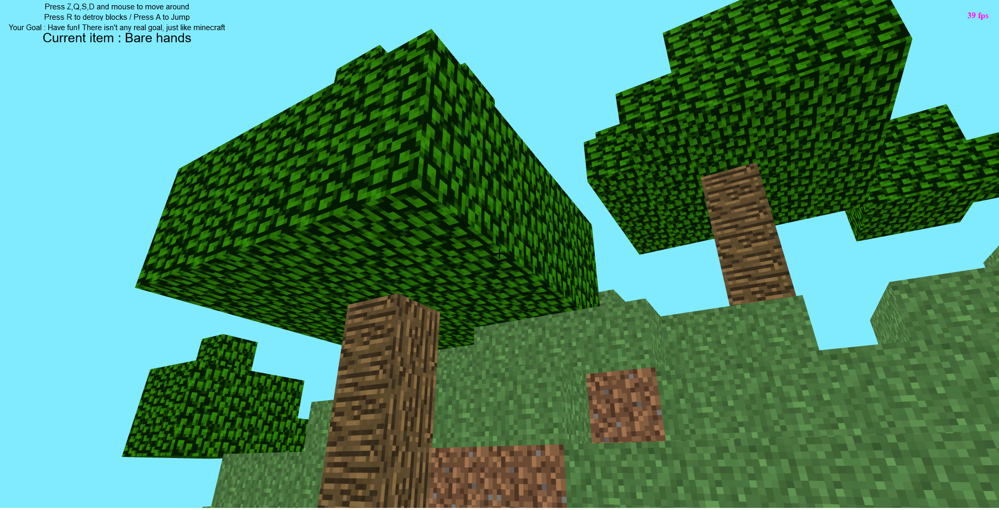
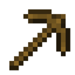
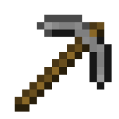
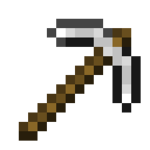

# Mine.js

|                                        |                                   |
| -------------------------------------- | --------------------------------- |
|  |  |

**[▶ Play](https://mrgove10.github.io/Mine.Js/)** (If you have an adblocker, some scripts may be blocked, please deactivate your adblock)

Mine.js is a javascript game made with [Babylon.js](https://www.babylonjs.com/).
Your goal is to find diamond as quick as possible ! It is heavily inspierd by [Minecraft](https://minecraft.net/).

- [Mine.js](#minejs)
  - [Features](#features)
  - [Craftables](#craftables)
  - [FAQ](#faq)

## Features

- Random procedural level generation
- Graphics similar to minecraft
- Jetpack! To get you out of those deep holes

## Craftables

Object are autocrafted once you have egnoth materials

|                                                  | object         | recipe               | name (internal) |
| ------------------------------------------------ | -------------- | -------------------- | --------------- |
|  | Wooden pickaxe | 5x wood              | woodenPickaxe   |
|    | Stone pickaxe  | 2x sticks + 3x stone | stonePickaxe    |
|      | Iron pickaxe   | 2x sticks + 3x iron  | ironPickaxe     |

## FAQ

Can i fall off the map ? **Yes, you will be teleported to the top of the map if you fall off**

can i generate another environment ? **Yes, just refresh the tab**

I can't jump ! **make sure you are very close to the block you are trying to jmp when pressing the jump key**
