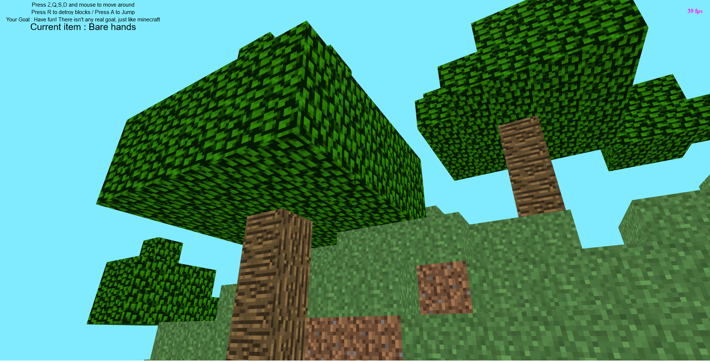

# Mine.js

|                                        |                                   |
| -------------------------------------- | --------------------------------- |
|  |  |

**[Play ▶](https://mrgove10.github.io/Mine.Js/)**

Mine.js is a javascript game made with [babylon.js](https://www.babylonjs.com/).
Your goal is to find diamond as quick as possible ! It is heavily inspierd by [Minecraft](https://minecraft.net/).

## Features

- Random procedural level generation
- Graphics similar to minecraft

## Craftables

Object are autocrafted

| object         | recipe               | name (internal) |
| -------------- | -------------------- | --------------- |
| wooden pickaxe | 5x wood              | woodenPickaxe   |
| stone pickaxe  | 2x sticks + 3x stone | stonePickaxe    |
| iron pickaxe   | 2x sticks + 3x iron  | ironPickaxe     |

## Info

if you have an adblocker, some scripts may be blocked, please deactivate your adblock

## roadmap

- autocrafting
- feed to keep up updated in the game events
- fastest way to find diamond
- reset the page if the user falls
